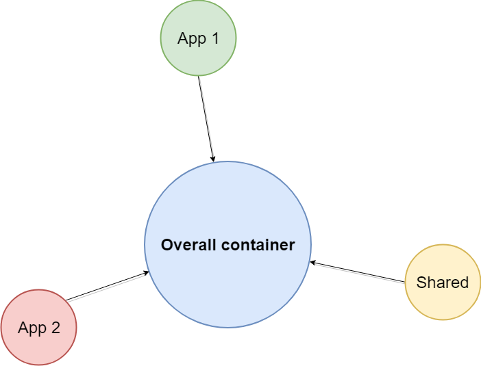

# Eagle Overall

## The main idea

The main idea is to have some overall application which will be used like a shell 
for other Eagle projects.

### Advantages:
* All projects located in separate repositories
* All project have independent “node_modules” and “package.json” config
* All project are distributed via npm/artifactory
* AOT compilation works good

### Disadvantages:
* To use projects like a module inside “overall container” we must:
  * build project via “ng-packagr” or other tool
  * publish projects to npm/artifactory
  * install it as dependency in “overall container”
* To deploy apps need to configure ci/cd for all apps separately
* Impossible to use different versions of Angular for some app and "overall container"
* Needed to test application twice: first separately, second - as part of overall container

Overall container for next apps:

* [reports](https://github.com/Investigations-eagle/reports)
* [core-eagle](https://github.com/Investigations-eagle/core-eagle)
